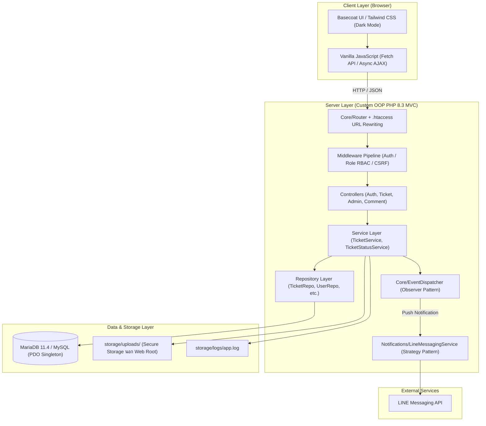
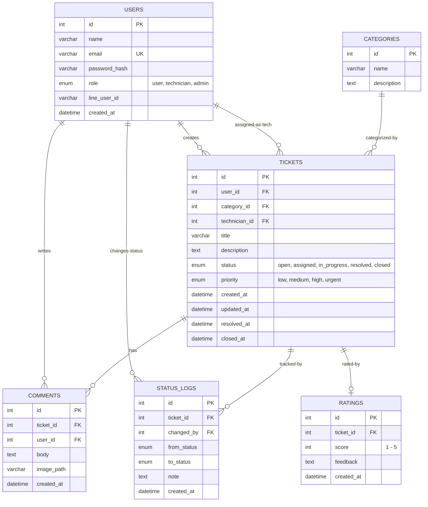
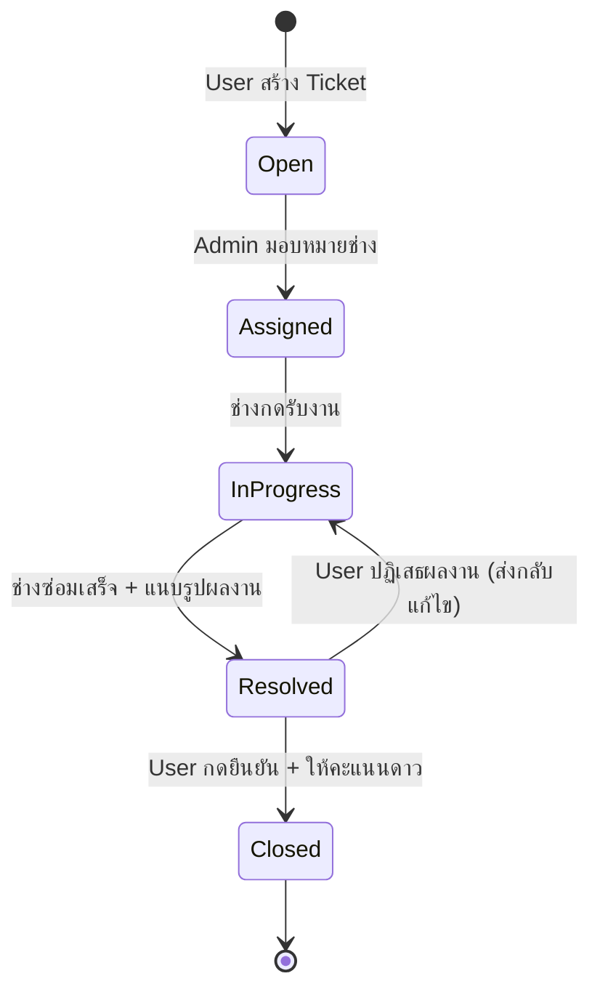

# 🛠️ Smart IT Helpdesk & Notification System

<div align="center">

[](https://www.php.net/)
[](https://mariadb.org/)
[](https://github.com/jirathxz/Smart-IT-Helpdesk)
[](https://developers.line.biz/)
[](https://github.com/jirathxz/Smart-IT-Helpdesk)
[](LICENSE)

**ระบบบริหารจัดการและแจ้งซ่อมอุปกรณ์ไอทีอัจฉริยะ พร้อมระบบแจ้งเตือนผ่าน LINE อัตโนมัติ**  
*Mini Project รายวิชา: การออกแบบและพัฒนาเว็บขั้นสูง (Advanced Web Design and Development)*  
สาขาวิชาเทคโนโลยีสารสนเทศ | สถาปัตยกรรม **Custom OOP PHP (No Framework)** ตามมาตรฐาน **PSR-4**

[สถาปัตยกรรมระบบ](#-สถาปัตยกรรมระบบ-system-architecture) •
[การแบ่งงาน 2 คน](#-แผนการแบ่งงานสำหรับ-developer-2-คน-5050-balanced-workload) •
[โครงสร้างฐานข้อมูล](#-โครงสร้างฐานข้อมูล-database-schema) •
[State Machine](#-ticket-state-machine--business-rules) •
[วิธีติดตั้งและใช้งาน](#-ขั้นตอนการติดตั้งและเริ่มใช้งาน-getting-started) •
[คู่มือ Merge สำหรับ Dev 1](#-คู่มือและแนวทางการ-merge-ระบบสำหรับ-developer-1-developer-1-merge-guide)

</div>

---

## 📖 บทนำและวัตถุประสงค์ (Overview)

**Smart IT Helpdesk** คือเว็บแอปพลิเคชันสำหรับบริหารจัดการงานบริการและแจ้งซ่อมอุปกรณ์ไอทีภายในองค์กร ออกแบบตามหลัก **Object-Oriented Programming (OOP)** และ **Design Patterns** ระดับสากล โดยไม่พึ่งพา Framework สำเร็จรูป (Pure PHP 8.2+) เพื่อแสดงถึงความเข้าใจอย่างลึกซึ้งในโครงสร้างสถาปัตยกรรม MVC, PSR-4 Autoloading, Data Access Layer และการรักษาความปลอดภัยของเว็บ

### จุดเด่นของระบบ (Key Highlights)
* **Custom MVC Framework**: พัฒนา Router, Controller, Service, Repository และ Middleware ขึ้นมาเอง 100%
* **Ticket State Machine**: ควบคุมวงจรชีวิตตั๋วแจ้งซ่อมอย่างเข้มงวด ป้องกันการเปลี่ยนสถานะข้ามขั้นตอนและตรวจสอบสิทธิ์ RBAC
* **Audit Trail Tracking**: บันทึกประวัติการเปลี่ยนสถานะผู้ปฏิบัติงาน วันเวลา และเหตุผลลงใน `status_logs` อัตโนมัติ
* **Event-Driven Notification**: เชื่อมโยง **Observer Pattern** เข้ากับ **LINE Messaging API** ส่งข้อความแจ้งเตือนทันทีเมื่อมีงานใหม่ มอบหมายช่าง หรือซ่อมเสร็จ
* **Basecoat UI Dark Theme**: ส่วนติดต่อผู้ใช้ที่ทันสมัย รองรับ Responsive ทั้งบน Mobile (สำหรับช่างหน้างาน) และ Desktop (สำหรับ Admin)
* **High-Level Security**: ป้องกัน SQL Injection ด้วย Prepared Statements 100%, CSRF Protection ทุกฟอร์ม, จัดเก็บรูปภาพไว้นอก Document Root

---

## 🏛️ สถาปัตยกรรมระบบ (System Architecture)



---

## 👥 แผนการแบ่งงานสำหรับ Developer 2 คน (50/50 Balanced Workload)

โครงการนี้ได้รับการจัดสรรภาระงานอย่างเท่าเทียมตามรูปแบบ **Feature-Based Fullstack Split** เพื่อให้ทั้ง 2 คนได้พัฒนาทั้งฝั่ง **Backend (OOP Logic)** และ **Frontend (UI / UX)** อย่างสมดุล:

| รายการเปรียบเทียบ | Developer 1 (Ticket Lifecycle & Operations) | Developer 2 (Core, Admin, Auto-Assign & Notification) |
| :--- | :--- | :--- |
| **บทบาทหลัก** | **วงจรชีวิต Ticket & การปฏิบัติงานของช่าง** | **โครงสร้างแกนกลาง, ระบบจ่ายงาน Auto, แดชบอร์ดผู้บริหาร & แจ้งเตือน LINE** |
| **Backend Logic** | • `TicketStatusService` (State Machine)<br>• `FileUploader` (MIME & Size Validator)<br>• `TicketService`, `CommentService`<br>• Enums (`TicketStatus`, `TicketPriority`) | • `Database` (PDO Singleton & Transaction)<br>• `Router` & `Middleware` (Auth, Role, CSRF)<br>• `AutoAssignService` (Smart Dispatch & Overload Prevention)<br>• `DashboardService` (Qualitative Analytics, Burn-down & KPIs)<br>• `ProfileController` (User Profile & Password Management)<br>• `LineMessagingService` & `EventDispatcher` |
| **Data Access** | • `TicketRepository`<br>• `CommentRepository`<br>• `StatusLogRepository`<br>• `RatingRepository` | • `UserRepository`<br>• `CategoryRepository`<br>• DDL Schema Migration (`database.sql`)<br>• Initial Seed Data |
| **Frontend UI** | • หน้าสร้าง Ticket (`create.php`) + พรีวิวภาพ<br>• หน้ารายการงานของฉัน/ช่าง (`index.php`)<br>• หน้ารายละเอียดงานซ่อม + Stepper Timeline<br>• Action Modals (รับงาน, ปิดงาน, ตรวจรับ, ให้คะแนน) | • Master Layout (`main.php`, Navbar Dropdown, Sidebar, Alerts)<br>• หน้า Authentication (`login.php`, `register.php`)<br>• Executive Dashboard (Health Banner, Intake vs Clearance, กราฟ 3 ตัว, Quick Auto-Assign)<br>• หน้าจัดการโปรไฟล์ผู้ใช้ & เปลี่ยนรหัสผ่าน (`profile/show.php`) |
| **JavaScript** | • `ticket.js` (AJAX Comments, Status Action, Star Rating) | • `dashboard.js` / Inline AJAX (ตัวกรองช่วงเวลาไดนามิก, Counter Animation, Accessible Dropdown) |
| **Design Patterns** | **State Pattern**, **Strategy Pattern** | **Singleton Pattern**, **Observer Pattern**, **Weighted Strategy / Rules Engine** |

---

## 🗄️ โครงสร้างฐานข้อมูล (Database Schema)

ฐานข้อมูลประกอบด้วย **6 ตารางหลัก** ที่มีความสัมพันธ์แบบ Foreign Key ครบถ้วน:



---

## 🔄 Ticket State Machine & Business Rules

การเปลี่ยนสถานะของ Ticket ถูกควบคุมผ่าน `TicketStatusService` และ PHP 8.1+ Backed Enum:



### Transition Rules Matrix

| From สถานะ | To สถานะ | สิทธิ์ที่อนุญาต (Role) | เงื่อนไขและ Action บังคับ |
| :--- | :--- | :--- | :--- |
| `Open` | `Assigned` | **Admin** | ต้องเลือก `technician_id` เพื่อจ่ายงาน |
| `Assigned` | `InProgress` | **Assigned Technician** | ช่างกดรับงานเข้าดำเนินการ |
| `InProgress` | `Resolved` | **Assigned Technician** | ต้องระบุสรุปการแก้ปัญหา และ **แนบรูปภาพผลการซ่อม** |
| `Resolved` | `Closed` | **Ticket Owner (User)** | ผู้แจ้งตรวจรับงาน และ **ประเมินคะแนนดาว 1-5** |
| `Resolved` | `InProgress` | **Ticket Owner (User)** | ผู้แจ้งไม่ยอมรับผลงาน พร้อม **ระบุเหตุผลการส่งกลับแก้ไข** |

---

## 📂 โครงสร้างโฟลเดอร์โครงการ (Project Structure)

```
Smart-IT-Helpdesk/
├── htdocs/                         # Apache DocumentRoot (Public Web Root)
│   ├── .htaccess                   # URL Rewriting เข้าสู่ Front Controller
│   ├── index.php                   # Application Front Controller
│   └── assets/                     # Static Assets (CSS, JS, Icons)
│       ├── css/app.css             # Basecoat UI / Dark Theme Styling
│       └── js/app.js               # AJAX, Modals, Star Rating Handler
├── src/                            # Application Code (PSR-4: App\)
│   ├── Core/                       # Framework Core (Database, Router, Auth, Middleware)
│   ├── Enums/                      # Backed Enums (TicketStatus, TicketPriority, UserRole)
│   ├── Models/                     # Data Entities & DTOs
│   ├── Repositories/               # Data Access Objects (PDO Prepared Statements)
│   ├── Services/                   # Business Rules (TicketStatusService, FileUploader)
│   ├── Observers/                  # Event Listeners (TicketObserver)
│   ├── Notifications/              # Push Services (LineMessagingService)
│   └── Controllers/                # Application & API Controllers
├── views/                          # PHP Templates & Views (อยู่นอก Web Root)
│   ├── layouts/                    # Master Layout, Navbar, Sidebar, Alerts
│   ├── auth/                       # Login & Registration Pages
│   ├── tickets/                    # Ticket Forms, List & Show/Detail
│   └── admin/                      # Dashboard, Users & Categories Management
├── storage/                        # Private Secure Storage (อยู่นอก Web Root)
│   ├── uploads/                    # รูปภาพแนบจาก User และผลงานของช่าง
│   └── logs/                       # Application & Notification Logs
├── composer.json                   # PSR-4 Autoloading Definition
├── database.sql                    # SQL DDL 6 ตาราง + Seed Data
├── .env.example                    # ตัวอย่างการตั้งค่า Environment Variables
├── run.bat                         # สคริปต์เปิดเซิร์ฟเวอร์แบบ All-in-one + Control Panel
└── stop.bat                        # สคริปต์ปิด Apache และ MariaDB ทันที
```

---

## 🚀 ขั้นตอนการติดตั้งและเริ่มใช้งาน (Getting Started)

### 1. ความต้องการของระบบ (Prerequisites)
* **PHP**: 8.2 ขึ้นไป (เปิด Extension `pdo_mysql`, `mysqli`, `curl`, `openssl`, `mbstring`)
* **Database**: MariaDB 10.4+ หรือ MySQL 8.0+ (Port: 3306)
* **Web Server**: Apache 2.4 (เปิดโมดูล `mod_rewrite`)

### 2. โคลนคลังโค้ด (Clone Repository)
```bash
git clone https://github.com/jirathxz/Smart-IT-Helpdesk.git
cd Smart-IT-Helpdesk
```

### 3. ติดตั้ง Dependencies (Composer Autoloader)
```bash
composer dump-autoload
```

### 4. นำเข้าฐานข้อมูล (Import Database)
สร้างฐานข้อมูลและตารางเริ่มต้นด้วยไฟล์ `database.sql`:
* ผ่าน **phpMyAdmin**: เปิด [http://localhost:8090/phpmyadmin](http://localhost:8090/phpmyadmin) &rarr; นำเข้า (Import) ไฟล์ `database.sql`
* หรือผ่าน **CLI**:
```bash
mariadb -u root -p < database.sql
```

### 5. ตั้งค่าไฟล์สภาพแวดล้อม (.env)
คัดลอกไฟล์ `.env.example` เป็น `.env` และปรับแต่งค่าตามต้องการ:
```env
APP_NAME="Smart IT Helpdesk"
APP_URL=http://localhost:8090

DB_HOST=127.0.0.1
DB_PORT=3306
DB_DATABASE=smart_helpdesk
DB_USERNAME=root
DB_PASSWORD=

LINE_CHANNEL_ACCESS_TOKEN=your_token_here
LINE_CHANNEL_SECRET=your_secret_here
```

### 6. เริ่มการทำงานของเซิร์ฟเวอร์ (One-Click Runner)
สำหรับผู้ใช้ Windows สามารถดับเบิลคลิกไฟล์ **`run.bat`**:
```cmd
run.bat
```
* สคริปต์จะเริ่มทำงานของ MariaDB และ Apache ให้อัตโนมัติ
* ระบบจะเปิด Browser ไปที่:
  * **หน้าเว็บโครงการ**: [http://localhost:8090](http://localhost:8090)
  * **phpMyAdmin**: [http://localhost:8090/phpmyadmin](http://localhost:8090/phpmyadmin)
* หากต้องการหยุดเซิร์ฟเวอร์ ให้กดตัวเลือกในเมนู หรือดับเบิลคลิก **`stop.bat`**

---

## 🔑 บัญชีผู้ใช้สำหรับการทดสอบ (Default Seed Accounts)

ระบบมาพร้อมข้อมูลจำลองและบัญชีผู้ใช้ครบทั้ง 3 บทบาท:

| บทบาท (Role) | อีเมล (Email) | รหัสผ่าน (Password) | สิทธิ์การทำงานหลัก |
| :--- | :--- | :--- | :--- |
| **Admin** | `admin@helpdesk.local` | `admin123` | ดูแดชบอร์ดสถิติ, จ่ายงานให้ช่าง, จัดการผู้ใช้และหมวดหมู่ |
| **Technician 1** | `tech@helpdesk.local` | `tech123` | ช่างสมชาย: รับงาน, อัปเดตความคืบหน้า, แนบรูปปิดงาน |
| **Technician 2** | `tech2@helpdesk.local` | `tech123` | ช่างวิชัย: ตรวจสอบและรับงานซ่อมด้านฮาร์ดแวร์/CCTV |
| **User** | `user@helpdesk.local` | `user123` | คุณสมหญิง: แจ้งซ่อมตั๋วใหม่, ติดตามสถานะ, ให้คะแนน 1-5 ดาว |

---

## 🔀 คู่มือและแนวทางการ Merge ระบบสำหรับ Developer 1 (Developer 1 Merge Guide)

เพื่อให้การรวมโค้ด (Merge) ระหว่าง **Developer 1** (รับผิดชอบส่วน Ticket Lifecycle, CRUD, Status Actions, Comments, Ratings) และ **Developer 2** (รับผิดชอบ Core Framework, Admin Executive Dashboard, Smart Auto-Assign, Notification, Layout) เป็นไปอย่างราบรื่น ปราศจาก Conflict และทำงานร่วมกันได้ทันที 100% โปรดปฏิบัติตามแนวทางดังต่อไปนี้:

### 1. ไฟล์และโมดูลที่ Developer 2 พัฒนาเสร็จสิ้นแล้วบน Branch `main`
* **Core MVC Architecture (`src/Core/`)**:
  * `Database.php`: Singleton PDO เชื่อมต่อฐานข้อมูล พร้อมฟังก์ชัน Transaction (`beginTransaction`, `commit`, `rollBack`)
  * `Router.php`: รองรับ Route Parameter (`/tickets/{id}`), Controller Dispatch, และ Middleware Pipeline
  * `Auth.php`, `Csrf.php`, `Env.php`, `EventDispatcher.php` (Observer Pattern สำหรับแจ้งเตือน LINE)
* **Smart Auto-Assign Engine (`src/Services/AutoAssignService.php`)**:
  * อัลกอริทึมคัดเลือกช่างอัตโนมัติ คำนวณจากภาระงานปัจจุบัน, ความเชี่ยวชาญตามหมวดหมู่, คะแนน CSAT และมีกลไกป้องกันงานโถม (Overload Avoidance) หัก 50 คะแนนเพื่อผันงานไปให้ช่างคนอื่นทันที
* **Executive Dashboard (`src/Services/DashboardService.php`, `views/admin/dashboard.php`)**:
  * แสดง 6 Core KPIs, แถบสุขภาพระบบ (Executive Health Summary), อัตราการระบายงาน (Intake vs Clearance), ตารางและกราฟเปรียบเทียบช่างเชิงคุณภาพ, ตัวกรองช่วงเวลา AJAX, พร้อมปุ่มจ่ายงาน `⚡ Auto` รายแถว และ `⚡ จ่ายงาน Auto ทั้งหมด`
* **User Profile & Security (`src/Controllers/ProfileController.php`, `views/profile/show.php`)**:
  * จัดการโปรไฟล์ส่วนตัว, ตั้งค่า LINE User ID, เปลี่ยนรหัสผ่าน BCRYPT
* **Master Layout & Theme (`views/layouts/`)**:
  * `main.php`, `navbar.php` (User avatar dropdown & typographic brand wordmark), `sidebar.php`, `alerts.php` (Flash messages)

---

### 2. ขอบเขตงานที่ Developer 1 ต้องเตรียมและเชื่อมต่อเข้ากับระบบ
Developer 1 มีหน้าที่พัฒนาและวางไฟล์ในโฟลเดอร์ต่อไปนี้ (ซึ่ง Dev 2 ได้เว้นว่างไว้ให้โดยเฉพาะ):
1. **Views สำหรับ Ticket (`views/tickets/`)**:
   * `views/tickets/index.php`: หน้ารายการตั๋วงาน (แสดงตั๋วของผู้ใช้ หรือคิวงานของช่าง)
   * `views/tickets/create.php`: ฟอร์มแจ้งซ่อมใหม่ (มี Dropdown หมวดหมู่, ช่องกรอกปัญหา, ตัวเลือก Priority, และช่องแนบรูปภาพ)
   * `views/tickets/show.php`: หน้ารายละเอียดตั๋วงาน + Timeline สถานะ + ช่องคอมเมนต์ + กล่องแนบรูป + ปุ่มกด Action ตามสถานะ (รับงาน, เริ่มงาน, ปิดงาน, ตรวจรับ)
2. **Controller & Services (`src/Controllers/`, `src/Services/`)**:
   * `src/Controllers/TicketController.php`: เมธอด `index()`, `create()`, `store()`, `show()`, `updateStatus()`, `addComment()`, `rate()`
   * `src/Services/TicketService.php`, `TicketStatusService.php` (State Machine), `FileUploader.php`
3. **Data Repositories (`src/Repositories/`)**:
   * `TicketRepository.php`, `CommentRepository.php`, `StatusLogRepository.php`, `RatingRepository.php`

---

### 3. ขั้นตอนการ Merge โค้ดทีละขั้นตอน (Step-by-Step Merge Workflow)

#### ขั้นตอนที่ 1: ดึงอัปเดตล่าสุดจาก Branch `main`
```bash
git checkout main
git pull origin main
git checkout your-dev1-branch
git merge main
```

#### ขั้นตอนที่ 2: จัดการจุดเชื่อมต่อใน `htdocs/index.php` (Route Registration)
ในไฟล์ `htdocs/index.php` ได้มีการจัดกลุ่ม Route ของระบบไว้อย่างเป็นระเบียบแล้ว Developer 1 เพียงเปิดใช้งานหรือเพิ่ม Route ของตนเองในกลุ่ม **Ticket Lifecycle Routes (Developer 1)** ดังนี้:
```php
// ==========================================================
// 4. Ticket Lifecycle Routes (Developer 1)
// ==========================================================
$router->get('/tickets', [TicketController::class, 'index'], ['auth']);
$router->get('/tickets/create', [TicketController::class, 'create'], ['auth']);
$router->post('/tickets', [TicketController::class, 'store'], ['auth', 'csrf']);
$router->get('/tickets/{id}', [TicketController::class, 'show'], ['auth']);
$router->post('/tickets/{id}/status', [TicketController::class, 'updateStatus'], ['auth', 'csrf']);
$router->post('/tickets/{id}/comments', [TicketController::class, 'addComment'], ['auth', 'csrf']);
$router->post('/tickets/{id}/rate', [TicketController::class, 'rate'], ['auth', 'csrf']);
```

#### ขั้นตอนที่ 3: โครงสร้าง Layout และ Navigation Links
* ใน View ของตั๋วงาน ให้ครอบเนื้อหาด้วย Master Layout ตามรูปแบบ:
  ```php
  <?php
  $title = 'รายการตั๋วแจ้งซ่อม - Smart IT Helpdesk';
  ob_start();
  ?>
  <!-- เนื้อหาหน้าเว็บของ Dev 1 -->
  <?php
  $content = ob_get_clean();
  include __DIR__ . '/../layouts/main.php';
  ?>
  ```
* ปุ่มแจ้งซ่อมใน `views/layouts/navbar.php` และเมนูตั๋วงานใน `views/layouts/sidebar.php` ลิงก์ไปยัง `/tickets/create` และ `/tickets` ไว้เรียบร้อยแล้ว เมื่อ Dev 1 วาง View และ Route จะคลิกใช้งานได้ทันที

#### ขั้นตอนที่ 4: การใช้งาน Database & Status Logs
* ในการบันทึกหรือเปลี่ยนสถานะตั๋วงาน สามารถเรียกใช้ตาราง `status_logs` ได้โดยตรง:
  ```sql
  INSERT INTO status_logs (ticket_id, changed_by, from_status, to_status, note, created_at)
  VALUES (:ticket_id, :changed_by, :from_status, :to_status, :note, NOW());
  ```
* เมื่อตั๋วงานเปลี่ยนสถานะ ให้เรียก EventDispatcher เพื่อแจ้งเตือน LINE อัตโนมัติ:
  ```php
  \App\Core\EventDispatcher::getInstance()->dispatch('ticket.status_changed', $ticketData);
  ```

#### ขั้นตอนที่ 5: ตรวจสอบความถูกต้องหลัง Merge (Verification Suite)
รันชุดทดสอบเพื่อยืนยันว่าการรวมโค้ดไม่กระทบส่วนแกนกลาง:
```bash
php tests/verify_backend.php
php tests/test_auto_assign.php
php tests/test_profile.php
php tests/test_dashboard_qualitative.php
```

---

## 🛡️ มาตรการความปลอดภัยของระบบ (Security Features)

1. **SQL Injection Prevention**: ใช้ PDO Prepared Statements และ Parameter Binding 100% ในทุก Repository
2. **CSRF Protection**: ระบบสร้างและตรวจสอบ Anti-CSRF Token ทุกครั้งที่มีการส่งข้อมูลแบบ POST, PUT, DELETE
3. **Role-Based Access Control (RBAC)**: คัดกรองสิทธิ์ระดับ Route ด้วย `AuthMiddleware` และ `RoleMiddleware` ป้องกันการเข้าถึง URL โดยตรง
4. **Isolated File Storage**: โฟลเดอร์ `storage/uploads/` อยู่ภายนอก `htdocs/` เพื่อป้องกันการรัน Script อันตรายผ่าน URL
5. **Secure Password Hashing**: เข้ารหัสผ่านด้วยฟังก์ชัน `password_hash()` มาตรฐาน BCRYPT

---

## 👨‍💻 ผู้พัฒนาและข้อมูลรายวิชา (Authors & Academic Info)

* **Repository**: [https://github.com/jirathxz/Smart-IT-Helpdesk](https://github.com/jirathxz/Smart-IT-Helpdesk)
* **รายวิชา**: การออกแบบและพัฒนาเว็บขั้นสูง (Advanced Web Design and Development)
* **สาขาวิชา**: เทคโนโลยีสารสนเทศ (Information Technology)
* **สถาปัตยกรรม**: Custom OOP PHP Edition (No Framework)

---

<div align="center">
  <sub>Developed with ❤️ for Academic Excellence in Modern Web Architecture</sub>
</div>
